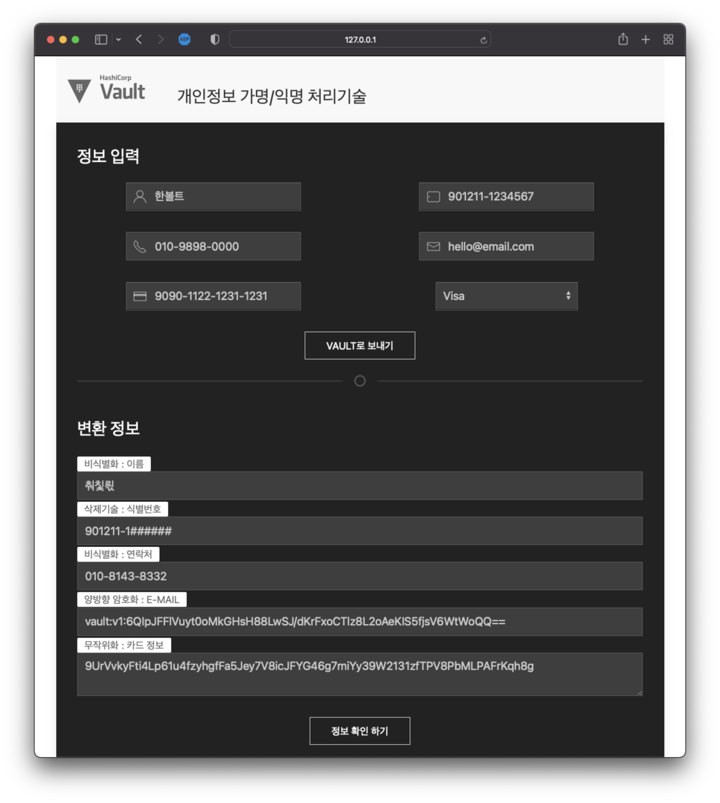

# Vault - Anonymization demo

## Tested env

- macOS Monterey 12.5 intel
- python 3.9.12
- HashiCorp Vault Enterprise v1.11.2+ent

## Python Setup

### pip install
```bash
# Install fastapi
pip install fastapi

# Install uvicorn
pip install uvicorn
```

### vault information
```python
# main.py
vault_addr = "http://127.0.0.1:8200"
headers = {
    'X-Vault-Token': 'root'
}
```

## Vault Setup

### License
Trial : <https://www.hashicorp.com/products/vault/trial>

### First terminal

VAULT_LICENSE_PATH=vault.hclic vault-ent server -dev -dev-root-token-id=root

### Second terminal

Terraform Apply or cli
- Terraform Code : [terraform/vault](./terraform/vault)
- CLI : [terraform/vault/cli.md](./terraform/vault/cli.md)

## Run Python Demo App

HOME DIR : [app](./app)

```bash
cd app
uvicorn main:app --reload
```

### Test index page
<http://127.0.0.1:8000/>

### Swagger UI
<http://127.0.0.1:8000/docs>

### API Doc
<http://127.0.0.1:8000/redoc>

### Demo screenshot
